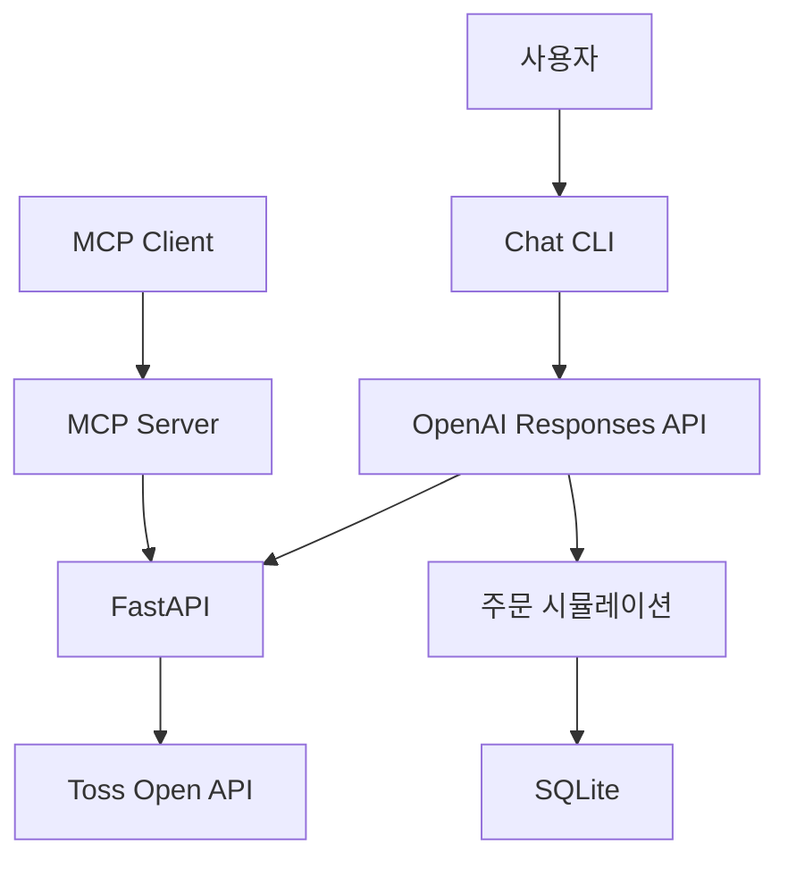

# Toss Investment Assistant

토스증권 Open API와 OpenAI Responses API를 활용한 개인 투자 비서 프로젝트입니다.

현재는 토스증권 계좌와 보유 종목을 읽기 전용으로 조회하고, 포트폴리오 비중 및 손익을 분석할 수 있습니다.

주문 기능은 안전한 개발과 검증을 위해 **DRY RUN 시뮬레이션만 지원**합니다. 실제 토스증권 주문은 전송하지 않습니다.

## 주요 기능

### 완료된 기능

- 토스증권 Open API OAuth2 인증
- 토스증권 계좌 목록 조회
- 국내·미국 주식 보유 종목 조회
- 보유 종목 단건 조회
- 통화별 포트폴리오 분석
- 종목별 평가금액 비중 계산
- 포트폴리오 집중도 분석
- FastAPI REST API
- MCP Server
- OpenAI Responses API 기반 Chat CLI
- SQLite 주문 상태 관리
- 주문 생성·승인·취소
- DRY RUN 주문 실행
- Pytest 자동화 테스트
- GitHub Actions CI

### 개발 예정 또는 보류

- AI 투자 브리핑 고도화
- 조건부 자동매매
- 실제 주문 연동
- 테스트 범위 확대
- 배당 예상 기능 — 토스증권 Open API에서 필요한 배당 데이터를 제공하지 않아 보류

## 기술 스택

- Python 3.12
- FastAPI
- Uvicorn
- Toss Investment Open API
- OpenAI Responses API
- MCP Python SDK
- SQLite
- Pytest
- GitHub Actions

## 시스템 구조



조회 기능은 FastAPI를 중심으로 동작합니다.

- Chat CLI는 OpenAI 도구 호출을 통해 FastAPI를 사용합니다.
- MCP Server도 FastAPI를 통해 계좌 정보를 조회합니다.
- 주문 미리보기와 상태는 SQLite에 저장됩니다.
- 주문 실행은 현재 DRY RUN으로만 처리됩니다.

## 프로젝트 구조

```text
toss-investment-assistant/
├── .github/
│   └── workflows/
│       └── tests.yml
├── src/
│   ├── ai_assistant.py
│   ├── api.py
│   ├── auth.py
│   ├── chat_cli.py
│   ├── config.py
│   ├── main.py
│   ├── mcp_server.py
│   ├── order_executor.py
│   ├── order_store.py
│   ├── portfolio.py
│   ├── service.py
│   └── web_server.py
├── tests/
│   ├── test_live_portfolio.py
│   ├── test_portfolio.py
│   ├── test_portfolio_concentration.py
│   └── test_web_server.py
├── .gitignore
├── README.md
└── requirements.txt
```

## 설치 방법

### 1. 저장소 복제

```powershell
git clone https://github.com/jangchimin/toss-investment-assistant.git
cd toss-investment-assistant
```

### 2. 가상환경 생성

```powershell
python -m venv .venv
```

### 3. 가상환경 활성화

Windows PowerShell:

```powershell
.\.venv\Scripts\Activate.ps1
```

### 4. 패키지 설치

```powershell
python -m pip install --upgrade pip
python -m pip install -r requirements.txt
```

## 환경변수 설정

프로젝트 루트에 `.env` 파일을 생성합니다.

```env
TOSS_CLIENT_ID=토스증권_CLIENT_ID
TOSS_CLIENT_SECRET=토스증권_CLIENT_SECRET
OPENAI_API_KEY=OpenAI_API_KEY
OPENAI_MODEL=gpt-5-mini
```

`OPENAI_MODEL`은 선택 항목이며, 설정하지 않으면 `gpt-5-mini`가 사용됩니다.

> `.env` 파일에는 인증 정보가 포함되므로 GitHub에 커밋하거나 공유하면 안 됩니다. 현재 `.gitignore`에서 `.env`를 제외하고 있습니다.

## 실행 방법

모든 명령어는 프로젝트 루트에서 가상환경을 활성화한 상태로 실행합니다.

### 보유 종목 CLI 조회

```powershell
python src/main.py
```

토스증권 인증 후 계좌 요약과 보유 종목을 터미널에 출력합니다.

### FastAPI 서버 실행

```powershell
python -m uvicorn web_server:app --app-dir src --host 127.0.0.1 --port 8001
```

서버 실행 후 다음 주소에서 확인할 수 있습니다.

- 기본 상태: http://127.0.0.1:8001
- 상태 확인: http://127.0.0.1:8001/health
- API 문서: http://127.0.0.1:8001/docs
- 포트폴리오: http://127.0.0.1:8001/portfolio
- 포트폴리오 분석: http://127.0.0.1:8001/portfolio/analysis

특정 종목 조회 예시:

```text
http://127.0.0.1:8001/holdings/NVDA
http://127.0.0.1:8001/holdings/005930
```

### MCP Server 실행

MCP Server를 실행하기 전에 FastAPI 서버가 `8001`번 포트에서 실행 중이어야 합니다.

새 터미널을 열고 다음 명령어를 실행합니다.

```powershell
python src/mcp_server.py
```

현재 MCP Server에서 제공하는 도구는 다음과 같습니다.

| MCP 도구 | 설명 |
|---|---|
| `get_portfolio_summary` | 전체 자산 요약과 보유 종목 조회 |
| `analyze_current_portfolio` | 통화별 손익, 종목 비중 및 집중도 분석 |
| `get_holding_by_symbol` | 티커 또는 종목 코드로 보유 종목 조회 |
| `check_server_health` | FastAPI 서버 상태 확인 |

MCP 도구는 모두 읽기 전용이며 매수·매도 또는 계좌 변경을 수행하지 않습니다.

### AI Chat CLI 실행

Chat CLI를 실행하기 전에 FastAPI 서버가 실행 중이어야 합니다.

```powershell
python src/chat_cli.py
```

질문 예시:

```text
내 포트폴리오를 요약해줘
미국 주식 수익률을 알려줘
NVDA를 보유하고 있는지 확인해줘
내 포트폴리오의 종목 비중을 분석해줘
집중도가 높은 종목이 있는지 알려줘
```

종료 명령:

```text
exit
quit
종료
```

## 포트폴리오 분석

포트폴리오 분석은 원화와 달러 자산을 서로 합산하지 않고 통화별로 계산합니다.

분석 결과에는 다음 정보가 포함됩니다.

- 통화별 총 매입금액
- 통화별 총 평가금액
- 통화별 총 평가손익
- 통화별 전체 수익률
- 통화별 당일 평가손익
- 종목별 평가금액 비중
- 가장 비중이 높은 종목
- 상위 3개 종목의 합산 비중
- 포트폴리오 집중도 등급
- 집중도 경고 사유

### 집중도 기준

| 등급 | 기준 |
|---|---|
| `high` | 단일 종목 비중이 50% 이상이거나 상위 3개 종목 비중이 80% 이상 |
| `medium` | 단일 종목 비중이 30% 이상이거나 상위 3개 종목 비중이 60% 이상 |
| `low` | 위 기준에 해당하지 않음 |
| `not_applicable` | 평가금액이 최소 분석 기준보다 작아 집중도를 판단하지 않음 |

### 최소 평가금액 기준

소액 포트폴리오에서 높은 비중만으로 과도한 위험 경고가 발생하지 않도록 최소 평가금액 기준을 적용합니다.

| 통화 | 최소 평가금액 |
|---|---:|
| KRW | 100,000원 |
| USD | 50달러 |

예를 들어 국내 주식 평가금액이 5만 원이고 한 종목의 비중이 80%라면, 비중 정보는 계산하지만 집중도 위험 등급은 `not_applicable`로 반환합니다.

> 집중도는 프로젝트 내부 기준으로 계산한 참고 정보이며 투자 권유나 매매 판단을 의미하지 않습니다.

## 주문 시뮬레이션

현재 주문 기능은 다음 상태 흐름으로 동작합니다.

```text
PENDING
→ APPROVED
→ EXECUTING
→ DRY_RUN_EXECUTED
```

- 주문 요청은 먼저 `PENDING` 상태로 저장됩니다.
- 사용자의 명시적인 승인을 받아야 `APPROVED` 상태가 됩니다.
- 승인과 실행은 서로 다른 단계입니다.
- 실행 단계에서도 실제 토스증권 주문은 전송되지 않습니다.
- 실행 결과는 `DRY_RUN_EXECUTED` 상태로 저장됩니다.
- 주문 상태와 실행 결과는 SQLite에 저장됩니다.

SQLite 데이터베이스 파일은 실행 중 `src/orders.db`에 생성될 수 있으며, `.gitignore`에 의해 Git 관리 대상에서 제외됩니다.

> 실제 주문 연동은 구현되지 않았습니다. `DRY_RUN_EXECUTED`는 실제 주문 체결이나 토스증권 전송을 의미하지 않습니다.

## 테스트

### 전체 자동화 테스트

```powershell
python -m pytest -q
```

기본 테스트에서는 실제 토스증권 API를 호출하지 않습니다.

테스트 데이터는 실제 계좌와 분리된 가상 데이터이며 다음 항목을 검증합니다.

- 빈 포트폴리오 처리
- 통화별 손익 계산
- 종목별 비중 계산
- KRW와 USD 분리
- 잘못된 숫자 및 누락 데이터 처리
- 포트폴리오 집중도 판정
- 소액 포트폴리오 집중도 판정 제외
- FastAPI 정상 응답
- FastAPI 오류 응답

### 실제 토스 API 테스트

실제 API 테스트는 기본적으로 건너뜁니다.

실행하려면 PowerShell에서 다음 명령어를 사용합니다.

```powershell
$env:RUN_LIVE_TESTS = "1"
python -m pytest tests/test_live_portfolio.py -q
```

같은 터미널에서 환경변수를 제거하려면 다음 명령어를 실행합니다.

```powershell
Remove-Item Env:RUN_LIVE_TESTS
```

터미널을 닫으면 해당 환경변수도 사라지므로 반드시 직접 제거해야 하는 것은 아닙니다.

실제 API 테스트는 계좌 및 보유 종목 조회만 수행하며 주문을 실행하지 않습니다.

## GitHub Actions

다음 상황에서 GitHub Actions가 자동으로 테스트를 실행합니다.

- 저장소에 코드가 Push됐을 때
- Pull Request가 생성되거나 변경됐을 때
- GitHub Actions 화면에서 수동 실행했을 때

CI 환경에서는 실제 토스증권 인증 정보를 사용하지 않으며, 실제 API 테스트는 자동으로 건너뜁니다.

워크플로 실행 환경:

- Windows 최신 버전
- Python 3.12
- `pytest`

## 보안 및 안전 원칙

- 인증 정보는 `.env`에서만 관리합니다.
- `.env`, SQLite DB, 로그 파일은 Git에 포함하지 않습니다.
- 실제 조회 결과에 없는 숫자는 AI가 임의로 추측하지 않습니다.
- 원화와 달러는 환율 정보 없이 합산하지 않습니다.
- 주문 승인과 주문 실행을 별도 단계로 관리합니다.
- 현재 주문 실행은 항상 DRY RUN입니다.
- 실제 매매 기능을 추가하기 전 별도의 안전성 검증이 필요합니다.

## 제한 사항

- 환율 변환을 지원하지 않습니다.
- 배당 예상 기능은 현재 제공하지 않습니다.
- 토스증권 Open API에서 필요한 배당 데이터를 제공하지 않아 배당 기능 개발을 보류했습니다.
- 포트폴리오 집중도는 프로젝트 내부 기준이며 투자 자문이 아닙니다.
- 실제 주문 전송 및 체결 기능은 구현되지 않았습니다.
- 조회 결과는 토스증권 Open API가 반환한 데이터에 의존합니다.

## 개발 로드맵

- [x] 토스증권 Open API 인증
- [x] 계좌 조회
- [x] 보유 종목 조회
- [x] FastAPI 서버
- [x] MCP Server
- [x] OpenAI 기반 Chat CLI
- [x] SQLite 주문 상태 관리
- [x] DRY RUN 주문 실행
- [x] 포트폴리오 손익 및 비중 분석
- [x] 포트폴리오 집중도 분석
- [x] 소액 포트폴리오 집중도 판단 제외
- [x] Pytest 자동화
- [x] GitHub Actions CI
- [ ] AI 투자 브리핑 고도화
- [ ] 조건부 자동매매 안전장치
- [ ] 실제 주문 연동
- [ ] 테스트 범위 확대
- [ ] 배당 예상 — Toss Open API 지원 여부 변경 시 재검토

## 주의사항

이 프로젝트는 개인 학습과 개발을 위한 프로젝트입니다.

포트폴리오 분석 결과와 AI 응답은 참고 정보이며 투자 자문이 아닙니다. 투자 판단과 그에 따른 책임은 사용자에게 있습니다.